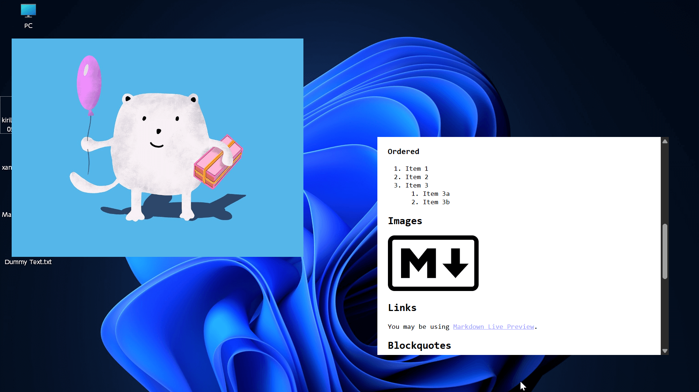
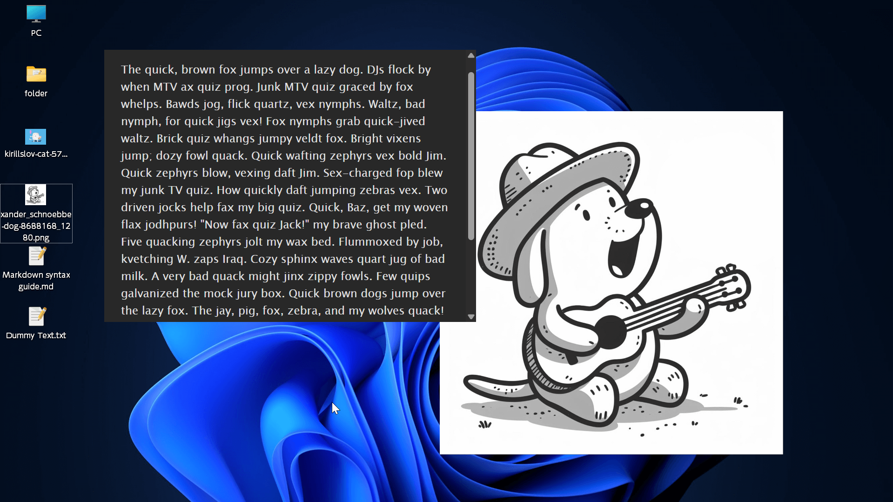
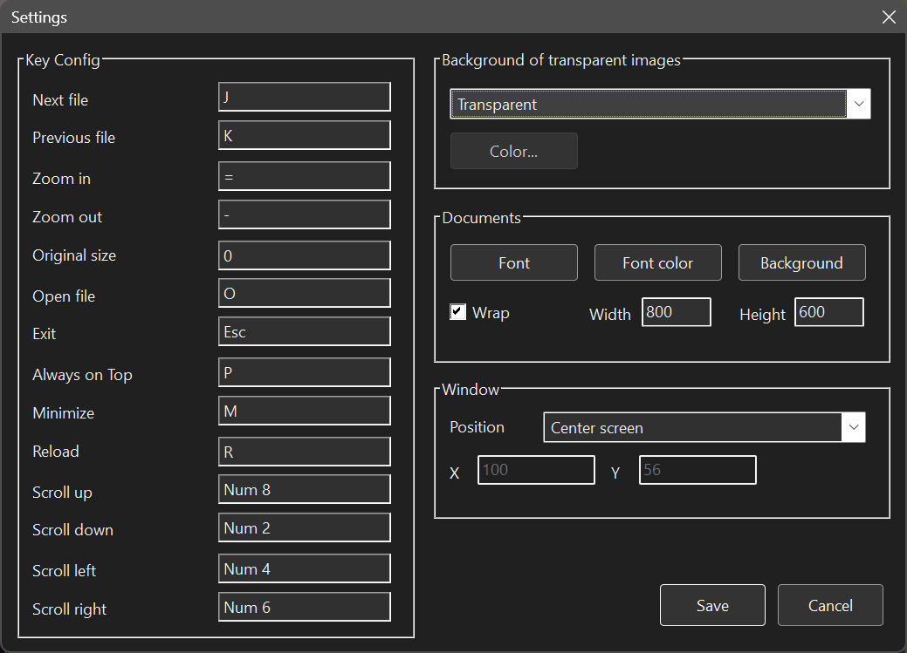

# FloatVision

**FloatVision** is a minimalist, frameless viewer for images, text, Markdown, and HTML.

By keeping your images or notes pinned to the top of your screen, it serves as a powerful reference tool for any workflow.

## Key Features

- **Frameless UI**: Focus entirely on your content without window clutter.

- **Always on Top**: Perfect for checking reference materials while working in other apps.

- **Portable Application**: No installer required. Runs from any folder without touching the Windows Registry.

- **Broad Format Support**:
  
  - **Images**: `.png`, `.jpg`, `.jpeg`, `.bmp`, `.gif`, `.tif`, `.tiff`, `.webp`
  
  - **Documents**: `.md`, `.markdown`, `.txt`, `.html`, `.htm`

## Prerequisites

- **OS**: Windows 10 20H2 or later.

- **WebView2 Runtime**: Required for rendering Markdown and HTML (typically pre-installed on modern Windows).

## Installation & Uninstallation

- **Install**: Simply extract the downloaded folder to any location. This app is portable and does not touch the Windows Registry.
  
  ⚠️ Installing under protected directories such as `Program Files` is not recommended, as write permissions are required.

- **Uninstall**: Delete the entire folder.

## How to Use

You can open files in three ways:

1. **Drag & Drop**: Launch `FloatVision.exe` and drop a file onto the window.

2. **In-App Context Menu**: Right-click on the window and select **Open** to choose a file.

3. **Command Line**: Run `FloatVision.exe "path/to/file"`.

## Controls

### General

- **Move**: Click and drag anywhere on the window.

- **Resize**: Drag the window edges.

- **Advanced**: Check the **Key Config** in Settings for customizable keyboard shortcuts.

### Image Viewer

- **Zoom**: Use the **Mouse Wheel** (Up/Down).

### Text, Markdown, & HTML

To interact with document content using your mouse, hold the **Alt** key:

- **Vertical Scroll**: `Alt` + `Mouse Wheel`

- **Horizontal Scroll**: `Alt` + `Shift` + `Mouse Wheel`

- **Zoom**: `Alt` + `Ctrl` + `Mouse Wheel`

## Settings

Right-click the window to open the **Context Menu**, then select **Settings**.

- Here you can customize keybindings and other preferences.

- Settings are automatically saved to an `.ini` file in the application folder.

## Custom Skins

If a file named `skin.png` is placed in the same directory as `FloatVision.exe`, it will be displayed as the default background upon startup.

## Project Page

https://github.com/f4rux/FloatVision

## Author

**f4rux**

## Third-Party Libraries

This project uses the following third-party library:

- **md4c**  
  A fast and compliant Markdown parser written in C.  
  Copyright © 2016–2024 Martin Mitáš  
  Licensed under the **MIT License**.  
  https://github.com/mity/md4c

## License

FloatVision is released under the **MIT License**.

See the `LICENSE` file for details.

## Support & Disclaimer

1. This project is provided "as-is" without any warranty or formal support. Please note that there are no planned updates for bug fixes or new features. What you see is the final version.